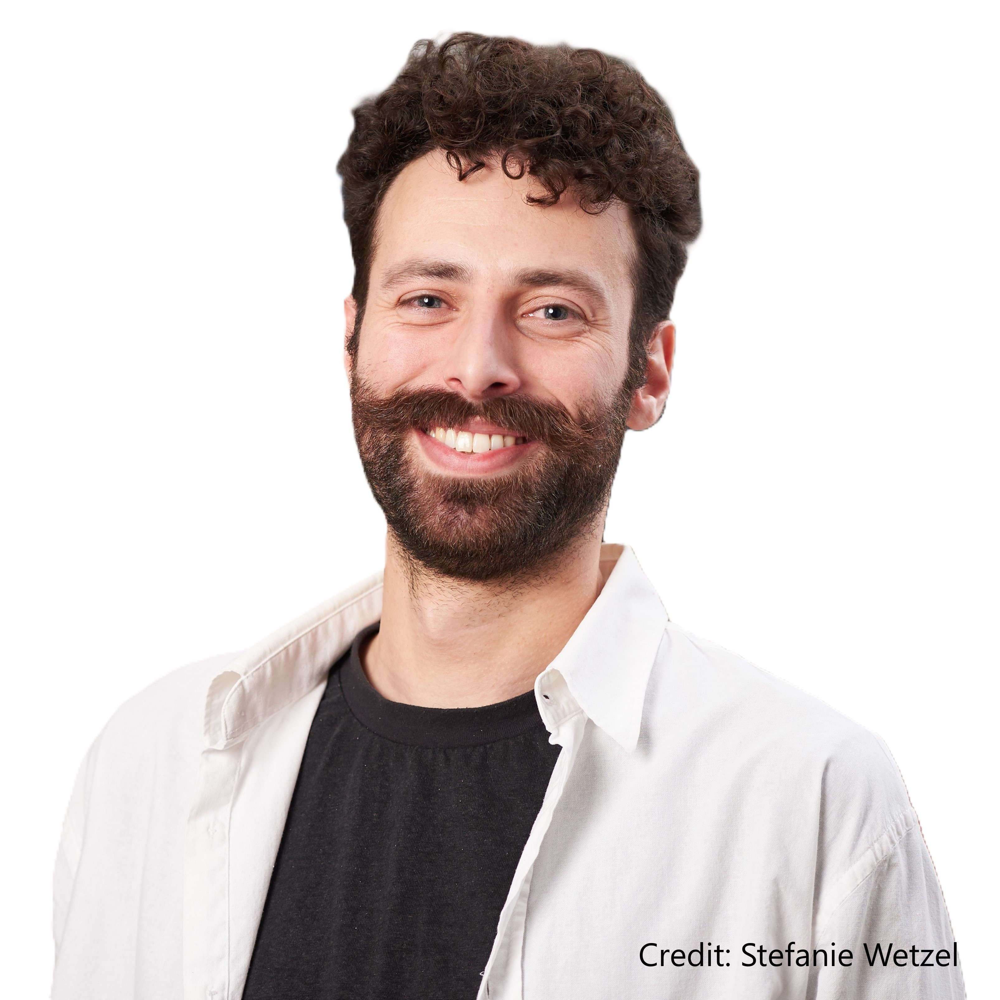

I'm a post-doctoral researcher working at the Institute of Linguistics of the Goethe University Frankfurt, as part of the [Visual Communication](https://vicom.info/) (ViCom) Research Priority Programme. Prior to that, I worked as a post-doc with [Bodo Winter](https://bodowinter.com/) at the University of Birmingham. I did my PhD at the University of Osnabrück, supervised by [Michael Franke](https://michael-franke.github.io/heimseite/) and [Manfred Krifka](https://www.leibniz-zas.de/en/people/details/krifka-manfred/manfred-krifka).

My research deals with various aspects of linguistic meaning and how people use language in different communicative settings (e.g. in face-to-face interaction, on the web, etc.). In particular, I'm interested in how people produce and interpret polysemous and polyfunctional linguistic forms in context. In my research I primarily use quantitative empirical methods, including controlled experimentation as well as statistical and corpus-analytic methods, to investigate questions related to pragmatic inferencing, strategic communication, argumentation and stance-taking, as well as expressive and affective meaning.

Aside from being interested in theoretical issues in linguistics and cognitive science, I'm interested in issues related to research design and methodology, and I teach basic data analysis and statistical modeling skills. I also co-organize DiscoMatiX, a group of researchers working on **Disco**urse and prag**Mati**cs using e**X**perimental approaches (visit https://discomatix.github.io/ for more information).
