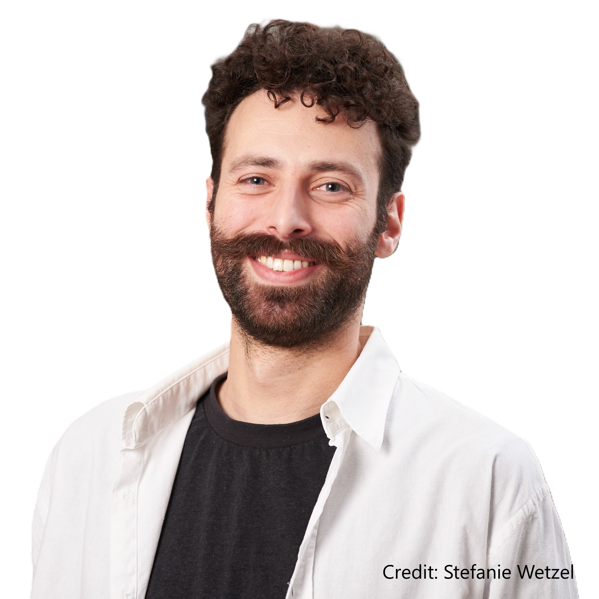

I'm a post-doctoral researcher working at the Goethe University Frankfurt as part of the [Visual Communication](https://vicom.info/) (ViCom) Resarch Priority Programme. Prior to that, I worked as a post-doc with [Bodo Winter](https://bodowinter.com/) at the University of Birmingham. I did my PhD at the University of Osnabrück, supervised by [Michael Franke](https://michael-franke.github.io/heimseite/) and [Manfred Krifka](https://www.leibniz-zas.de/en/people/details/krifka-manfred/manfred-krifka).

I'm interested in various aspects of linguistic meaning, in particular its relation to polysemous and polyfunctional linguistic forms and how people use those forms in different communicative settings (e.g. in face-to-face interaction, online, etc.). In my research I primarily use quantitative empirical methods, including controlled experimentation as well as statistical and corpus-analytic methods, to investigate questions related to pragmatic inferencing, strategic communication, argumentation and stance-taking, as well as expressive and affective meaning.

Aside from being interested in theoretical issues in linguistics and cognitive science, I'm also interested in issues related to research design and methodology, and I teach basic data analysis and statistical modeling skills.
